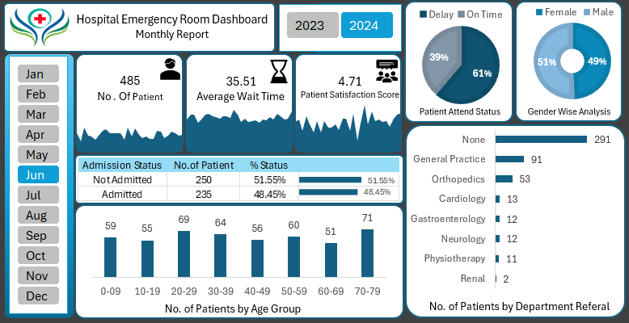

# 🏥 Hospital Emergency Room Data Analysis Dashboard

## 📌 Project Overview

This project presents an interactive **Hospital Emergency Room Dashboard** built to analyze patient activity and emergency room performance.

The dashboard provides insights into patient volume, average waiting time, patient satisfaction, admission status, patient demographics, attendance status, and department referrals.

## 📊 Dashboard Preview

## 🎯 Project Objectives

- Analyze the total number of ER patients
- Monitor average patient waiting time
- Evaluate patient satisfaction scores
- Analyze admission vs. non-admission rates
- Understand patient distribution across age groups and gender
- Identify the most common department referrals
- Analyze patient attendance status
- Compare emergency room activity across different months and years

## 🔍 Key Insights

- **485 patients** were recorded for the selected period.
- Average patient waiting time was approximately **35.51 minutes**.
- Average patient satisfaction score was **4.71**.
- **48.45%** of patients were admitted, while **51.55%** were not admitted.
- Patient distribution was almost evenly split between male and female patients.
- The **70–79 age group** recorded the highest patient count among the displayed age groups.
- General Practice and Orthopedics were among the major referred departments.

## 🛠️ Tools Used

- Microsoft Power BI
- Microsoft Excel
- Data Cleaning
- Data Visualization
- Dashboard Design

## 📁 Files

- `dashboard.png` – Final dashboard preview
- `hospital_er_dataset.xlsx` – Dataset used for the analysis

## 💡 Skills Demonstrated

- Data Cleaning and Preparation
- Data Analysis
- KPI Development
- Data Visualization
- Interactive Dashboard Development
- Healthcare Data Analysis
